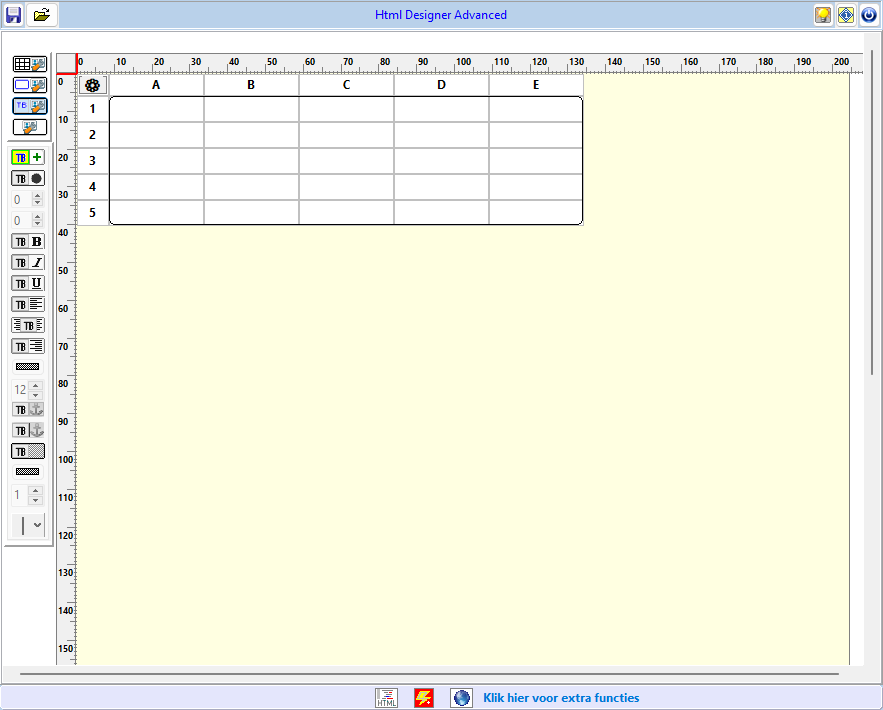

# Advanced Html Designer

Visual HTML table designer for Lazarus / Free Pascal — as a ready-to-use
program for Windows and Linux, and as reusable Lazarus components.

*Nederlandstalige uitleg: zie [onderaan](#nederlands).*



## Features

- Design an HTML table on a page with rulers in mm
- Add, delete, merge and unmerge rows, columns and cells
- Cell formatting: bold, italic, underline, alignment, colours, font size, borders, rounded corners
- Images in cells (left / centre / right, size), text and image hyperlinks
- Free-floating **text blocks** anywhere on the page, positioned with the mouse or to the millimetre
- Export as a complete HTML document or as table-only HTML, preview in your browser
- Save and load designs (`.htd`)
- User interface in **Dutch, English, French and German**, with a built-in translation editor
- Built-in help in all four languages — also [online](https://willem750-win.github.io/AdvancedHtmlDesigner/)

## Download

All downloads are on the [Releases](../../releases) page.

### Windows

Download the zip, unzip it anywhere and run `Advanced Html Designer.exe`.
No installation needed. Keep `talen.lng` and the `help` folder next to the program.

### Linux (Debian, Ubuntu, Linux Mint …)

Download the `.deb` package and install it:

```
sudo apt install ./advanced-html-designer_<version>_amd64.deb
```

The program appears in the menu under **Development** and can also be started
with `advanced-html-designer`. Your designs, settings and translations are kept in
`~/.local/share/advanced-html-designer`. To remove the program:

```
sudo apt remove advanced-html-designer
```

### Linux with Wine

The Windows version also runs under [Wine](https://www.winehq.org/):
unzip the Windows download and start it with `wine "Advanced Html Designer.exe"`.

## Building from source

Requirements: [Lazarus](https://www.lazarus-ide.org/) 4.x with Free Pascal 3.2.2 or newer.

```
git clone https://github.com/willem750-win/AdvancedHtmlDesigner.git
```

This repository contains two Lazarus packages and a demo program:

| Folder | Package / project | Description |
|---|---|---|
| `core/` | `tabledesignerhtml.lpk` (TableDesignerHtml) | Base component `THtmlTableDesigner` |
| `advanced/` | `htmltabledesigner_advanced.lpk` | `THtmlTableDesignerAdvanced` with floating toolbox, translations and settings |
| `advanced/project/` | `project1.lpi` | The **Advanced Html Designer** program |

Steps:

1. In Lazarus, open `core/tabledesignerhtml.lpk` and choose *Use > Install*.
2. Open `advanced/htmltabledesigner_advanced.lpk` and choose *Use > Install*.
   Lazarus rebuilds the IDE; the components appear on the **JanWilly** palette tab.
3. For the demo program, also install the **ExpandPanels** package
   (it provides the roll-out panel `TMyRollOut`).
4. Open `advanced/project/project1.lpi` and build it.

The same steps work in Lazarus on Linux (GTK2 widgetset). To turn the Linux
build into a `.deb` package, run on Linux:

```
sh advanced/project/tools/make-deb.sh 1.1.0
```

The package is written to `advanced/project/tools/deb/`.

## License

[MIT](LICENSE) © 2026 Willy Jansen

---

## Nederlands

**Advanced Html Designer** is een visuele ontwerper voor HTML-tabellen, gemaakt
met Lazarus / Free Pascal. Het bestaat uit een kant-en-klaar programma voor
Windows en Linux, en herbruikbare Lazarus-componenten.

- **Windows:** download de zip bij [Releases](../../releases), pak hem
  uit en start `Advanced Html Designer.exe`. Laat `talen.lng` en de map `help`
  naast het programma staan.
- **Linux (Debian, Ubuntu, Linux Mint …):** download het `.deb`-pakket bij
  [Releases](../../releases) en installeer het met
  `sudo apt install ./advanced-html-designer_<versie>_amd64.deb`. Het programma
  staat daarna in het menu onder **Ontwikkeling**; je ontwerpen en instellingen
  komen in `~/.local/share/advanced-html-designer`. Verwijderen gaat met
  `sudo apt remove advanced-html-designer`.
- **Linux met Wine:** de Windows-versie werkt ook onder Wine:
  `wine "Advanced Html Designer.exe"`.
- **Zelf compileren:** installeer in Lazarus eerst `core/tabledesignerhtml.lpk`,
  daarna `advanced/htmltabledesigner_advanced.lpk`. Voor het voorbeeldprogramma
  heb je ook het pakket **ExpandPanels** nodig. Open dan
  `advanced/project/project1.lpi`. Dat werkt ook in Lazarus onder Linux (GTK2);
  met `sh advanced/project/tools/make-deb.sh 1.1.0` maak je daar een `.deb`-pakket.
- De help (in het programma via de Help-knop) is beschikbaar in het Nederlands,
  Engels, Frans en Duits, en ook
  [online](https://willem750-win.github.io/AdvancedHtmlDesigner/nl/index.html).
